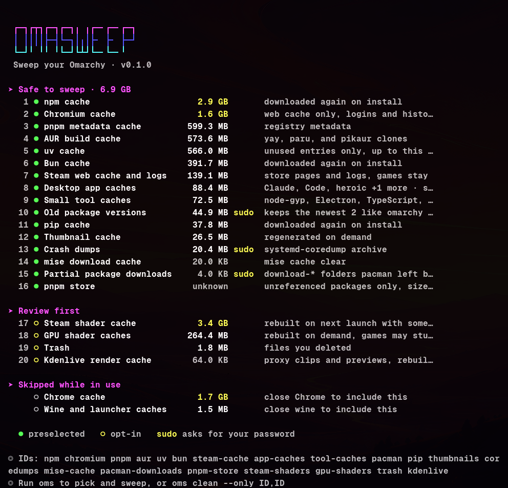
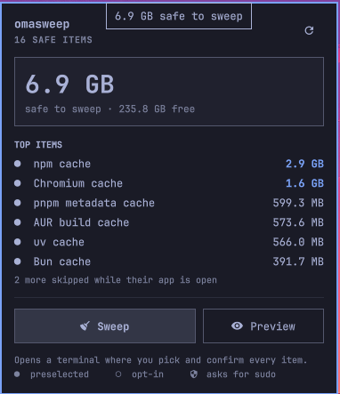

# omasweep

**English** · [한국어](README.ko.md)

Reclaim disk space on [Omarchy](https://omarchy.org). omasweep is a terminal cleaner (`oms`) plus an
Omarchy shell bar widget. It knows where an Arch + Hyprland machine piles up space: the pacman
cache, old [mise](https://mise.jdx.dev) tool versions, Docker and Podman, package caches for every
language Omarchy sets up, browser and Electron app caches, Flatpak, Steam and Wine, AI model
caches, and build output in projects you stopped touching. More than 60 targets, and only the ones
present on your machine show up.

<p align="center">
  
</p>

## Highlights

- **Ranked by value.** Safe items come first, largest first, and are preselected. Items that cost
  you something (Trash, shader caches, project dependencies, orphaned packages) are listed but
  stay opt-in.
- **You pick, then it sweeps.** A checklist (via [gum](https://github.com/charmbracelet/gum)) lets
  you toggle items, then you confirm once. `--dry-run` shows exactly which commands would run and
  which directories would be emptied.
- **Uses each tool's own cleanup.** `mise prune`, `docker builder prune`, `paccache`,
  `journalctl --vacuum-time`, `uv cache prune`, `go clean`, and `pnpm store prune` instead of
  deleting their data behind their back.
- **Leaves running apps alone.** Caches of an open browser, Electron app, Flatpak app, or game
  launcher are skipped, and the check runs again right before sweeping.
- **Omarchy-native.** Follows the active theme (ANSI palette and Omarchy's gum colors), keeps two
  package versions like `omarchy update` does, opens in Omarchy's floating terminal from the bar,
  and asks for `sudo` in that terminal only when a selected item needs it.
- **Honest numbers.** The summary shows what was swept and how much free space actually changed.
  When those differ (Btrfs snapshots or hard links still hold the data), it says so.

## Install

### Bar widget and CLI

```bash
omarchy plugin add https://github.com/e2goon/omasweep.git --enable
~/.config/omarchy/plugins/io.github.e2goon.omasweep/bin/oms link
```

The first command installs the widget into the bar. The second links `oms` into `~/.local/bin` so
you can run it from any terminal. `omarchy plugin update io.github.e2goon.omasweep` updates both.

<p align="center">
  
</p>

The widget shows how much can be swept safely and the largest items. **Sweep** and **Preview**
open `oms` in Omarchy's floating terminal, where you pick and confirm every item.

### CLI only

```bash
git clone https://github.com/e2goon/omasweep.git ~/.local/share/omasweep
~/.local/share/omasweep/bin/oms link
```

Requirements: Bash 5, coreutils, findutils, and `jq` (for `oms scan --json` and the widget). `gum`
is used when present and ships with Omarchy. Tools such as `mise`, `docker`, `paccache`
(`pacman-contrib`), `uv`, or `pnpm` are only used when installed; their targets are skipped
otherwise.

## Uninstall

```bash
rm ~/.local/bin/oms
omarchy plugin remove io.github.e2goon.omasweep
```

The first command removes the `oms` link. The second takes the widget off the bar and deletes the
plugin. For a CLI-only install, run `rm -rf ~/.local/share/omasweep` instead of the second command.
To also drop your whitelist and the operation log, run
`rm -rf ~/.config/omasweep ~/.local/state/omasweep`.

## Usage

```bash
oms                         # scan, pick, confirm, sweep
oms scan                    # show what can be reclaimed, change nothing
oms clean --dry-run         # walk through a sweep without deleting anything
oms clean --yes             # sweep every safe item without prompts
oms clean --only mise,docker-build
oms clean --all --skip trash
oms whitelist               # protect paths or whole targets
oms log                     # what was removed, skipped, or failed
```

| Option | Meaning |
| --- | --- |
| `-n`, `--dry-run` | Preview the sweep. Nothing is deleted and nothing is logged. |
| `-y`, `--yes` | Do not ask. Sweeps the safe items unless `--all` or `--only` is given. |
| `-a`, `--all` | Preselect review items too. |
| `--only ID,...` | Sweep only these targets. IDs are listed by `oms scan`. |
| `--skip ID,...` | Leave these targets out. |
| `--debug` | Print each command and its output. |
| `--hold` | Wait for a key before exiting. The bar widget uses this. |

Without a terminal, `oms clean` refuses to run unless you pass `--yes` or `--dry-run`. Running it
as root is refused as well; it asks for `sudo` itself.

## What it sweeps

Only targets that exist on your machine show up. Run `oms scan` to see them with their IDs.

### How targets are chosen

- **Safe** targets hold data their owner recreates on its own: download caches, build caches,
  logs, crash dumps, and tool versions no config refers to. The only cost is a re-download or a
  rebuild. They are preselected.
- **Review** targets cost something noticeable or may hold things you want: Trash, offline music,
  AI models, shader caches (games stutter while they rebuild), project dependencies, orphaned
  packages, and container images. They are listed but stay opt-in.
- **Never** touched: logins, cookies, history, settings, local storage, mail, game saves, Wine
  prefixes, Steam `compatdata`, Docker volumes and containers, project sources, the Maven
  repository (it can hold artifacts you built locally), NuGet packages, and Ollama models
  (use `ollama rm`).
- When a tool has its own cleanup command, omasweep calls it instead of deleting the tool's data.
- Caches of running apps are skipped. Chromium-based browsers and Electron apps are detected by
  the `SingletonLock` in their profile, Firefox-based browsers by the profile `lock`, Flatpak apps
  by `flatpak ps`, and everything else by process name. The check runs again right before
  sweeping.
- Symlinked cache folders are never followed, and nothing outside `$HOME` is deleted except
  through the fixed `sudo` commands listed below.

### System

| ID | What | Tier | How |
| --- | --- | --- | --- |
| `pacman` | Old package versions | safe, sudo | `paccache -rk2` and `paccache -ruk0` |
| `pacman-downloads` | `download-*` folders an interrupted update left in the pacman cache | safe, sudo | remove them |
| `journal` | Archived journal files older than four weeks | safe, sudo | `journalctl --vacuum-time=4weeks` |
| `coredumps` | `systemd-coredump` archive | safe, sudo | delete files in `/var/lib/systemd/coredump` |
| `flatpak-unused` | Flatpak runtimes no installed app needs | safe, sudo | `flatpak uninstall --unused` (user and system) |
| `thumbnails` | Thumbnail cache | safe | empty `~/.cache/thumbnails` |
| `orphans` | Packages installed as dependencies that nothing needs | review, sudo | `pacman -Rns` on `pacman -Qdtq` |
| `trash` | Trash | review | empty `~/.local/share/Trash` |
| `installers` | `.deb`, `.rpm`, `.pkg.tar.*`, `.iso`, `.dmg`, `.exe`, `.msi` in Downloads untouched for 30 days | review | remove the files |

### Containers

| ID | What | Tier | How |
| --- | --- | --- | --- |
| `docker-build` | Docker build cache | safe | `docker builder prune -af` |
| `docker-images` | Every image no container uses, including ones you pulled on purpose | review | `docker image prune -af` |
| `podman-images` | The same for Podman | review | `podman image prune -af` |

### Developer tools

| ID | What | Tier | How |
| --- | --- | --- | --- |
| `mise` | Tool versions no mise config refers to | safe | `mise prune` |
| `mise-cache` | mise download cache | safe | `mise cache clear` |
| `ai-cli-versions` | Old Claude Code and Cursor Agent builds, keeping the active one and one previous | safe | remove the older builds |
| `aur` | yay, paru, and pikaur build clones | safe | empty their cache folders |
| `npm`, `pnpm`, `yarn`, `bun`, `deno`, `corepack` | JavaScript package caches | safe | empty the cache folders |
| `pnpm-store` | Store packages no project links to | safe | `pnpm store prune` |
| `uv`, `pip`, `poetry` | Python package caches | safe | `uv cache prune`, empty the others |
| `go-build` | Go build cache | safe | empty `~/.cache/go-build` |
| `cargo`, `rustup` | Crate archives and rustup downloads (sources and toolchains stay) | safe | empty the folders |
| `gradle` | Gradle build cache and daemon logs (downloaded dependencies stay) | safe | empty the folders |
| `composer`, `ruby`, `dotnet`, `beam`, `jvm-tools`, `zig`, `ccache`, `opam`, `android` | Composer, RubyGems and Bundler, NuGet HTTP, Hex and rebar3, Coursier, Zig, ccache, opam, and Android build caches | safe | empty the cache folders |
| `tool-caches` | node-gyp, Electron, TypeScript, Vite, webpack, ESLint, Prettier, Ruff, mypy, pre-commit | safe | empty the cache folders |
| `go-mod` | Go module cache | review | `go clean -modcache` |
| `test-browsers` | Playwright, Puppeteer, and Cypress browsers | review | empty the cache folders |
| `jetbrains` | JetBrains IDE caches and indexes | review | empty `~/.cache/JetBrains` |

### Browsers

| ID | What | Tier | How |
| --- | --- | --- | --- |
| `chromium`, `chrome`, `edge`, `brave`, `vivaldi`, `opera` | `~/.cache/<browser>` plus code, GPU, and shader caches inside the profile | safe | empty the cache folders |
| `firefox`, `zen`, `librewolf` | `~/.cache/<browser>` | safe | empty the cache folder |

### Apps

| ID | What | Tier | How |
| --- | --- | --- | --- |
| `app-caches` | Cache folders of every Electron or Chromium-based app found in `~/.config` (VS Code, Obsidian, Discord, Slack, Signal, ...) | safe | empty `Cache`, `Code Cache`, `GPUCache`, `Dawn*Cache`, `CachedData`, `Crashpad` |
| `flatpak-caches` | `~/.var/app/*/cache` | safe | empty the cache folders |
| `spotify` | Spotify cache, including songs saved for offline listening | review | empty `~/.cache/spotify` |
| `kdenlive` | Kdenlive proxy clips and previews | review | empty `~/.cache/kdenlive` |
| `gpu-shaders` | Mesa, RADV, and NVIDIA shader caches | review | empty the cache folders |

### Games

| ID | What | Tier | How |
| --- | --- | --- | --- |
| `steam-cache` | Steam store page cache and logs | safe | empty the folders |
| `steam-shaders` | Steam shader cache | review | empty `steamapps/shadercache` |
| `wine-caches` | winetricks downloads, Lutris and Heroic caches | review | empty the cache folders |

### AI

| ID | What | Tier | How |
| --- | --- | --- | --- |
| `huggingface` | Hugging Face hub cache | review | empty the cache folders |
| `ml-models` | PyTorch hub and Whisper models | review | empty the cache folders |
| `lmstudio` | LM Studio models | review | empty the models folder |

### Projects

| ID | What | Tier | How |
| --- | --- | --- | --- |
| `project-artifacts` | `node_modules`, `.next`, `.nuxt`, `.svelte-kit`, `.turbo`, `.parcel-cache`, `.angular`, Rust and Maven `target`, Python `.venv`/`venv`, `.gradle`, `.dart_tool`, and Composer `vendor` in projects untouched for 30 days | review | remove the folders |

A folder only counts when its project marker sits next to it (`package.json`, `Cargo.toml`,
`pyvenv.cfg`, `composer.json`, ...). Only the outermost match is taken, folders directly in
`$HOME` are ignored, `target` folders with a `deploy` directory (Solana keys) are kept, and Go or
Rails `vendor` folders are left alone. Each project is checked again right before removal.

Btrfs snapshots are not deleted; if a sweep frees less than expected on a snapper-managed root,
omasweep tells you to review `sudo snapper list`.

## Whitelist

`oms whitelist` opens `~/.config/omasweep/whitelist`. One entry per line:

```
# Skip a whole target
docker-images

# Never delete this path or anything below it. Globs work.
~/.cache/pnpm
~/Work/keep-this/node_modules
```

## Settings

| Variable | Default | Meaning |
| --- | --- | --- |
| `OMS_PACMAN_KEEP` | `2` | Package versions kept in the pacman cache |
| `OMS_JOURNAL_KEEP` | `4weeks` | Journal age kept by `journalctl --vacuum-time` |
| `OMS_STALE_DAYS` | `30` | Days without changes before project build output or a downloaded installer counts as stale |
| `OMS_PROJECT_DIRS` | `~/Projects:~/projects:~/Code:~/code:~/src:~/dev:~/Work:~/work` | Where to look for project build output |
| `NO_COLOR` | unset | Disable colors |

The widget has two settings. `showSize` puts the safe total next to the icon, and
`refreshIntervalMin` sets how often that total is rescanned:

```bash
omarchy bar set io.github.e2goon.omasweep showSize true --json
omarchy bar set io.github.e2goon.omasweep refreshIntervalMin 60 --json
```

## Files

| Path | Purpose |
| --- | --- |
| `~/.config/omasweep/whitelist` | Protected paths and skipped targets |
| `~/.local/state/omasweep/operations.log` | Every removal, command, skip, and failure (rotated at 5 MB) |

## Development

```bash
git clone https://github.com/e2goon/omasweep.git ~/Work/omasweep
ln -s ~/Work/omasweep ~/.config/omarchy/plugins/io.github.e2goon.omasweep
omarchy-shell shell rescanPlugins
omarchy plugin enable io.github.e2goon.omasweep
tests/run.sh
```

`tests/run.sh` never touches your system. It:

- checks syntax, runs `shellcheck` when installed (`uvx --from shellcheck-py shellcheck` works
  too), runs `qmllint` against the Omarchy shell modules, and validates the plugin manifest
- replaces `sudo`, `paccache`, `pacman`, `journalctl`, `mise`, `docker`, `uv`, `go`, `pnpm`,
  `flatpak`, and `ps` with stubs that record their arguments, so every cleanup command is checked
  exactly
- sweeps a throwaway home directory and confirms what is removed and what survives: whitelisted
  paths, symlink targets, caches of running apps, recent projects, and anything outside `$HOME`

After editing `BarWidget.qml` through a symlinked checkout, run `omarchy restart shell` to load
the change.

The plugin follows the [Omarchy shell plugin manual](https://github.com/omacom/omarchy/blob/quattro/manual/32-shell-plugins.md)
and [shell reference](https://github.com/omacom/omarchy/blob/quattro/docs/omarchy-shell.md).

## Credits

The CLI flow (dry run, whitelist, operation log, in-use deferral, and the free-space summary) is
inspired by [Mole](https://github.com/tw93/mole), the macOS cleaner by tw93. omasweep shares no code
with Mole and is not affiliated with it.

## License

[MIT](LICENSE)
